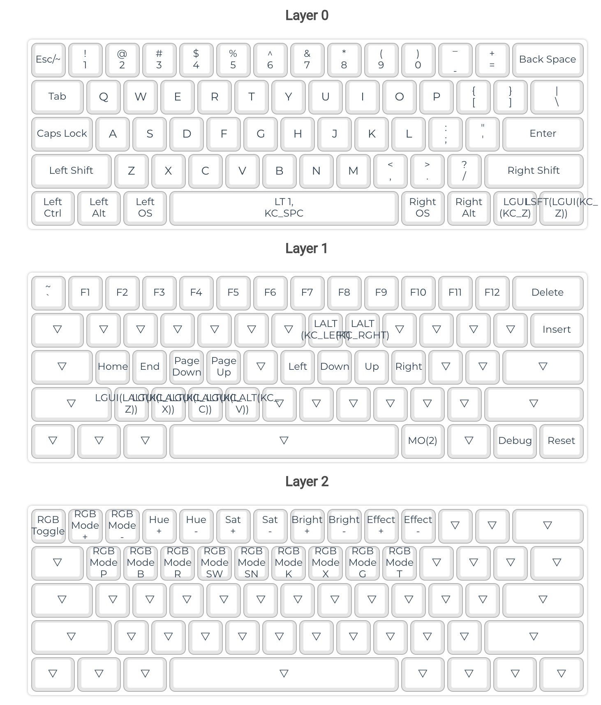

# MJ61 键位设置
https://config.qmk.fm/
https://docs.qmk.fm/#/keycodes

## 键位解释
### Layer Switching

|Key             |Description                                                                       |
|----------------|----------------------------------------------------------------------------------|
|`DF(layer)`     |Set the base (default) layer                                                      |
|`MO(layer)`     |Momentarily turn on `layer` when pressed (requires `KC_TRNS` on destination layer)|
|`OSL(layer)`    |Momentarily activates `layer` until a key is pressed. See [One Shot Keys](one_shot_keys.md) for details. |
|`LM(layer, mod)`|Momentarily turn on `layer` (like MO) with `mod` active as well.  Where `mod` is a mods_bit.  Mods can be viewed [here](mod_tap.md).  Example Implementation: `LM(LAYER_1, MOD_LALT)`|
|`LT(layer, kc)` |Turn on `layer` when held, `kc` when tapped                                       |
|`TG(layer)`     |Toggle `layer` on or off                                                          |
|`TO(layer)`     |Turns on `layer` and turns off all other layers, except the default layer |
|`TT(layer)`     |Normally acts like MO unless it's tapped multiple times, which toggles `layer` on |

### RGB Lighting
|Key             |Description                                                                       |
|----------------|----------------------------------------------------------------------------------|
| RGB Toggle     | 等效开关   |
| RGB Mode +     | 样式切换 - |
| RGB Mode -     | 样式切换 - |
| RGB hue +      | 色相 + |
| RGB hue -      | 色相 - |
| RGB sat +      | 饱和度 + |
| RGB sat -      | 饱和度 - |
| RGB bright +   | 亮度 + |
| RGB bright -   | 亮度 - |
| RGB effect +   | 速度 + |
| RGB effect -   | 速度 - |
| RGB_M_P	| 静态 |
| RGB_M_B	| 呼吸 |
| RGB_M_R	| 彩虹动画 |
| RGB_M_SW	| 旋流动画 |
| RGB_M_SN	| 蛇动画 |
| RGB_M_K	| 霹雳游侠动画 |
| RGB_M_X	| 圣诞动画 |
| RGB_M_G	| 静态渐变动画 |
| RGB_M_T	| 红色，绿色，蓝色测试动画 |